# Pesquisa: Cinco Sistemas Operacionais em Contextos Radicalmente Diferentes

**Disciplina:** Estrutura e Arquitetura de Sistemas Operacionais
**Extensão da atividade de Formatação e Instalação do Windows**

---

# 📑 Sumário

- [Introdução](#introdução)
- [1. O Sistema Operacional do Apollo Guidance Computer (Apollo 11)](#1-o-sistema-operacional-do-apollo-guidance-computer-apollo-11)
  - [Contexto](#contexto)
  - [Kernel base](#kernel-base)
  - [Capacidades e arquitetura](#capacidades-e-arquitetura)
  - [A peculiaridade mais famosa: os alarmes 1201 e 1202](#a-peculiaridade-mais-famosa-os-alarmes-1201-e-1202)
  - [Onde estão os conceitos estudados](#onde-estão-os-conceitos-estudados)
- [2. O Sistema Operacional do Xbox 360](#2-o-sistema-operacional-do-xbox-360)
  - [Kernel base](#kernel-base-1)
  - [Arquitetura](#arquitetura)
  - [Peculiaridades](#peculiaridades)
- [3. VxWorks — O Sistema Operacional do Telescópio James Webb](#3-vxworks--o-sistema-operacional-do-telescópio-james-webb)
  - [Kernel base](#kernel-base-2)
  - [O que é o VxWorks](#o-que-é-o-vxworks)
  - [Capacidades](#capacidades)
  - [Peculiaridade única do JWST: JavaScript a bordo](#peculiaridade-única-do-jwst-javascript-a-bordo)
- [4. CP/M — Control Program for Microcomputers](#4-cpm--control-program-for-microcomputers)
  - [Kernel base](#kernel-base-3)
  - [Arquitetura em três camadas](#arquitetura-em-três-camadas)
  - [Por que isso foi revolucionário](#por-que-isso-foi-revolucionário)
  - [A peculiaridade histórica: como o CP/M perdeu para a Microsoft](#a-peculiaridade-histórica-como-o-cpm-perdeu-para-a-microsoft)
- [5. Meta Horizon OS — O Sistema Operacional do Meta Quest 3](#5-meta-horizon-os--o-sistema-operacional-do-meta-quest-3)
  - [Kernel base](#kernel-base-4)
  - [Arquitetura: um fork do Android](#arquitetura-um-fork-do-android)
  - [Capacidades específicas de computação espacial](#capacidades-específicas-de-computação-espacial)
  - [Peculiaridades de gerenciamento de recursos](#peculiaridades-de-gerenciamento-de-recursos)
- [6. Comparação Geral](#6-comparação-geral)
  - [6.1 Tabela comparativa](#61-tabela-comparativa)
  - [6.2 Comparação dedicada dos kernels](#62-comparação-dedicada-dos-kernels)
  - [6.3 Diferenças de propósito](#63-diferenças-de-propósito)
  - [6.4 Diferenças funcionais mais marcantes](#64-diferenças-funcionais-mais-marcantes)
- [7. Árvore Genealógica](#7-árvore-genealógica)
  - [7.1 Diagrama](#71-diagrama)
  - [7.2 Explicação de cada linhagem](#72-explicação-de-cada-linhagem)
  - [7.3 Convergência: onde as linhagens se encontram](#73-convergência-onde-as-linhagens-se-encontram)
- [8. Conclusão](#8-conclusão)
- [9. Referências](#9-referências)

---

## Introdução

Quando falamos em "sistema operacional", a imagem que vem à cabeça costuma ser a de um desktop com janelas, ícones e um mouse. Mas essa é apenas uma das formas possíveis. Um sistema operacional é, em essência, a camada de software que **gerencia recursos de hardware e oferece abstrações para que programas possam ser executados** — e isso pode acontecer em uma nave espacial, em um console de videogame, em um telescópio a 1,5 milhão de quilômetros da Terra, em um microcomputador de 1974 ou em um óculos de realidade mista.

Esta pesquisa analisa cinco sistemas operacionais escolhidos justamente por serem **extremos opostos** dentro do mesmo conceito:

| # | Sistema | Contexto | Ano | Kernel base |
|---|---|---|---|---|
| 1 | **Executive/Waitlist (AGC)** | Missão Apollo 11 | 1966–1969 | Nenhum — kernel original escrito do zero em assembly do AGC |
| 2 | **Xbox 360 System Software** | Console de videogame | 2005 | Kernel **Windows NT** (via Windows 2000 → kernel do Xbox original), sob um hypervisor |
| 3 | **VxWorks (ISIM/JWST)** | Telescópio espacial James Webb | 2021 | Kernel proprietário **Wind River** (*wind kernel*), original |
| 4 | **CP/M** | Microcomputadores pessoais | 1974 | Nenhum — kernel original (**BDOS**) escrito em PL/M |
| 5 | **Meta Horizon OS** | Óculos de realidade mista Quest 3 | 2023 | Kernel **Linux**, via AOSP |

Ao final, há uma comparação estruturada e uma "árvore genealógica" ligando cada um deles aos sistemas modernos.

---

# 1. O Sistema Operacional do Apollo Guidance Computer (Apollo 11)

## Contexto

O **AGC (Apollo Guidance Computer)** foi o computador de bordo instalado tanto no Módulo de Comando quanto no Módulo Lunar das missões Apollo. Seu software de voo foi desenvolvido no **MIT Instrumentation Laboratory**, com **Margaret Hamilton** liderando a divisão de engenharia de software — sendo, inclusive, uma das pessoas que popularizou o próprio termo "engenharia de software".

O sistema operacional em si foi projetado por **J. Halcombe (Hal) Laning**, e era composto por dois componentes centrais: o **Executive (Exec)** e o **Waitlist**.

## Kernel base

> **Kernel base: nenhum — construído do zero.**

O AGC é o caso mais radical dos cinco: **não existia nenhum sistema operacional anterior a ser reaproveitado**. Em 1966 não havia mercado de RTOS comerciais, não havia código-fonte de terceiros para adaptar e nem sequer existia o conceito formal de "sistema de tempo real" como disciplina acadêmica.

Detalhes técnicos do kernel:

- **Tipo:** executivo em tempo real monolítico — não há distinção entre "kernel" e "sistema operacional", os dois são a mesma coisa
- **Linguagem:** assembly do AGC (uma linguagem de montagem própria da máquina, com cerca de 50 opcodes)
- **Tamanho:** o Executive inteiro tem aproximadamente **600 linhas de assembly**
- **Sem separação de privilégios:** não há modo usuário nem modo kernel; todo código roda com acesso irrestrito ao hardware
- **Sem alocação dinâmica de memória:** os *core sets* e as *VAC areas* são pools fixos definidos em tempo de compilação

O que se costuma chamar de "kernel do AGC" é, na prática, o conjunto de módulos `EXECUTIVE.agc`, `WAITLIST.agc`, `INTERRUPT_LEAD_INS.agc` e `FRESH_START_AND_RESTART.agc`, todos disponíveis publicamente hoje, já que o código do Apollo é domínio público.

Havia ainda um componente incomum: um **interpretador** embarcado (desenvolvido pela equipe do MIT), que executava uma pseudolinguagem de operações vetoriais e de dupla precisão (`DLOAD`, `VXSC`, `UNIT`, `SINE`…). Era mais lento que assembly puro, mas cada instrução interpretada ocupava muito menos espaço em ROM — uma troca deliberada de **velocidade por memória**, o recurso mais escasso da máquina.

## Capacidades e arquitetura

O AGC era uma máquina de **palavras de 15 bits + 1 bit de paridade**, rodando a aproximadamente **2,048 MHz**, com cerca de **2.048 palavras de memória apagável** (memória de núcleo magnético, equivalente a ~4 KB de RAM) e cerca de **36.864 palavras de memória fixa** (~72 KB de ROM).

Peculiaridade notável: a memória fixa era a chamada **core rope memory** ("memória de corda"), literalmente **tecida à mão** com fios de cobre passando através ou ao redor de minúsculos núcleos de ferrite. Um fio passando *dentro* do núcleo representava um bit; passando *por fora*, o outro. Uma vez tecido, o programa era fisicamente imutável — não existia "atualizar o software" depois do lançamento.

### O Executive

O Executive gerenciava **jobs** — blocos de software de tamanho arbitrário. Cada job tinha um **número de prioridade**, e o Executive sempre executava o job de maior prioridade disponível. Era um **escalonamento cooperativo por prioridade**: um job podia ser pausado por outro de prioridade maior, e o estado do job pausado era salvo em uma estrutura de doze registradores chamada **core set**.

Aqui está a peculiaridade mais importante: o número de core sets era **fixo e pequeno** (oito no Módulo Lunar do Apollo 11). Isso significa que **no máximo oito jobs podiam existir simultaneamente**. Não havia alocação dinâmica ilimitada — e isso era proposital: com um pool fixo de recursos, era possível *provar matematicamente* que o escalonador nunca ficaria sem espaço de forma imprevisível.

### O Waitlist

O Waitlist era um **escalonador preemptivo dirigido por interrupções de timer**. Ele disparava **tasks** — trechos curtíssimos de execução (no máximo ~5 milissegundos) — em instantes precisos, usando o contador de hardware TIME3. Tipicamente, uma task fazia uma leitura rápida (por exemplo, de um sinal de radar) e então agendava um job no Executive para o processamento mais pesado.

Note a relação direta com os conceitos da atividade anterior: **task ≈ thread curta com deadline rígido; job ≈ processo com prioridade**.

## A peculiaridade mais famosa: os alarmes 1201 e 1202

Durante a descida do Módulo Lunar Eagle, em 20 de julho de 1969, o computador começou a emitir alarmes **1202** e depois **1201**.

O que aconteceu: o radar de encontro (*rendezvous radar*) estava configurado de forma que seus sensores de ângulo eram excitados por uma referência de 800 Hz diferente da usada pelo computador, e as duas nunca estavam em fase. Isso fazia a antena parecer estar em movimento constante, gerando **milhares de pedidos espúrios de incremento de contador por segundo** — cada um roubando um ciclo de memória. A análise pós-voo do MIT estimou uma carga extra de cerca de **13%** na CPU. Quando Buzz Aldrin ainda inseriu o comando **1668** (para exibir DELTAH, a diferença entre a altitude medida pelo radar e a calculada), a carga passou do limite.

O resultado é o ponto crucial: **o computador não travou**. Os códigos de alarme eram um vocabulário estruturado de diagnóstico — **1201** significava "sem áreas VAC disponíveis" e **1202** significava "sem core sets disponíveis" (ou seja, *executive overflow*). O sistema executou um **restart por software**, descartou os jobs de baixa prioridade (incluindo a exibição do DELTAH) e **manteve rodando apenas as tarefas críticas de guiagem e controle**. O pouso continuou.

Essa é, historicamente, uma das primeiras demonstrações práticas de **degradação graciosa sob sobrecarga** — o princípio de que, quando há mais trabalho do que capacidade, o correto é **descartar trabalho de baixa prioridade**, não desacelerar tudo igualmente. Sistemas modernos chamam isso de *backpressure* ou *circuit breaker*.

Outro detalhe: o Executive sempre mantinha um job de prioridade mínima chamado **dummy job**. Quando o dummy job rodava, significava que o AGC não tinha nada melhor a fazer — e a luz verde de "atividade do computador" era desligada.

## Onde estão os conceitos estudados

| Conceito | Como aparece no AGC |
|---|---|
| Kernel | Executive + Waitlist são, juntos, o núcleo — não havia camada abaixo deles |
| Processos | "Jobs", com prioridade e core set próprio |
| Threads | "Tasks" curtas, disparadas por timer |
| Escalonamento | Por prioridade, com preempção parcial e descarte sob sobrecarga |
| Modos de execução | Não havia separação usuário/kernel — todo código rodava com acesso total |
| Sistema de arquivos | **Não existia**. Programas viviam em ROM tecida; dados, na memória apagável |
| E/S e drivers | Rotinas dedicadas (o **Pinball** tratava o teclado/display DSKY); acesso direto a canais de hardware |

---

# 2. O Sistema Operacional do Xbox 360

## Contexto

O **Xbox 360 System Software** (popularmente "Dashboard") foi lançado junto com o console em **22 de novembro de 2005**, na versão **2.0.1888.0**. A última atualização de software disponibilizada foi a **2.0.17559.0**, de 12 de novembro de 2019 — quase 14 anos de vida de plataforma.

## Kernel base

> **Kernel base: Windows NT** — mais precisamente, o kernel do Windows 2000, herdado através do kernel do Xbox original.

Esta é a linhagem mais bem documentada dos cinco, e também a mais mal compreendida. A cadeia é:

```
Windows NT (Dave Cutler, 1993)
   └── Windows 2000 (kernel NT 5.0)
          └── xboxkrnl.exe  — Xbox original, 2001
                 └── kernel do Xbox 360, 2005
```

Pontos importantes para não confundir:

- **Não é "o Windows rodando no console".** É o *kernel* do NT, drasticamente reduzido: no Xbox original, o kernel inteiro cabia em uma ROM de 512 KB, com módulos de dispositivos legados removidos e tudo — kernel, drivers, suporte — compilado em **um único executável**, sem diretório `Windows` e sem arquivos de driver separados.
- **APIs parecidas, não idênticas.** O kernel exporta funções familiares do Win32 (`CreateThread`, `WaitForSingleObject`), mas remove o que não faz sentido: não existe `CreateWindow`, porque todo gráfico passa por uma versão própria do Direct3D.
- **Camada de abstração de hardware mínima.** Diferente de um PC, quase tudo fala praticamente direto com o hardware, eliminando o overhead de software da HAL — uma escolha de desempenho.
- **Tipo de kernel:** híbrido/monolítico (o NT é classicamente descrito como híbrido), executando sobre uma arquitetura **PowerPC** de três núcleos.
- **Contribuição lateral do Windows CE:** os executáveis do 360 (formato **XEX**) usam tabelas de exceção no formato do Windows CE, porque o backend do compilador PowerPC derivou das ferramentas criadas para o port do CE — o port do NT para PowerPC havia sido encerrado pela Microsoft em fevereiro de 1997.

E há uma peculiaridade estrutural única: **o kernel não é a camada mais privilegiada**. Abaixo dele existe o hypervisor, e o kernel roda efetivamente como "hóspede". Isso inverte a hierarquia tradicional de dois anéis que estudamos (usuário/kernel) e cria três níveis: **aplicação → kernel → hypervisor**.

## Arquitetura

O sistema roda sobre um **processador PowerPC de três núcleos** (o "Xenon", desenvolvido pela IBM), o que é uma escolha curiosa: o Xbox original usava x86. A arquitetura de software tem três camadas:

### 2.1 Hypervisor

Diferente do Xbox original, o 360 introduziu um **hypervisor** — uma camada de software que fica **abaixo** do sistema operacional. O hypervisor roda em modo real, com os privilégios mais altos, com paginação de memória desativada e acesso a qualquer espaço de memória do sistema, incluindo dispositivos mapeados em memória. Código em modo usuário **não pode ler nem escrever** no espaço do hypervisor.

A função principal do hypervisor não é virtualização no sentido de "rodar vários SOs", mas **segurança**: ele gerencia a criptografia e as assinaturas digitais de todo executável que rodar no console. Nenhum código não assinado pela Microsoft roda — foi exatamente por isso que a comunidade *homebrew* precisou de exploits (como o famoso "King Kong") para conseguir executar Linux via projeto **Free60**, o que só se tornou viável em março de 2007 após a descoberta de uma falha crítica no hypervisor.

### 2.2 Kernel

O kernel do Xbox 360 é descendente direto do kernel do Xbox original, que por sua vez era **baseado no código do Windows 2000** — ou seja, é um **kernel da linhagem Windows NT**, fortemente reduzido e customizado. Ele expõe APIs semelhantes às do Win32 (`CreateThread`, `WaitForSingleObject`), mas removeu tudo o que não fazia sentido em um console: não há `CreateWindow`, porque todo gráfico passa por uma versão própria do Direct3D.

Detalhe de compilação interessante: os executáveis do Xbox 360 (formato **XEX**, *Xenon Executable*) usam tabelas de exceção no formato do **Windows CE**, e não no formato NT clássico, porque o backend do compilador PowerPC usado derivou das ferramentas criadas para o port do Windows CE para PowerPC.

Acima do kernel existe o módulo **XAM**, que cuida de perfis de jogador, conquistas (*achievements*) e toda a interatividade online.

### 2.3 Restrições de recursos

Uma peculiaridade que mostra bem o compromisso "console vs. PC": o software de sistema tinha acesso a **no máximo 32 MB** dos 512 MB de RAM do console. Todo o resto era reservado ao jogo. Originalmente, o próprio sistema residia em um sistema de arquivos de apenas **16 MB**; a partir da atualização **NXE (New Xbox Experience, novembro de 2008)** passou a exigir mais armazenamento, atendido por HD instalado ou pela memória flash embutida nas revisões posteriores.

### 2.4 Sistemas de arquivos

O Xbox 360 usa **vários** sistemas de arquivos simultaneamente, cada um para um propósito:

- **FATX** — armazenamento em HDs, memory units e dispositivos USB
- **GDFX/XSF** (*Game Disc Format for Xbox*) — mídia óptica (DVD)
- **STFS** (*Secure Transacted File System*) — saves, perfis, jogos Arcade e DLC
- **NAND File System** — bootloaders, kernel e keyvault na memória NAND

Isso ilustra bem um ponto conceitual: **sistema de arquivos não é uma coisa só**; é uma escolha de engenharia por caso de uso, e um mesmo SO pode implementar vários.

## Peculiaridades

- O boot é uma **cadeia de bootloaders verificados criptograficamente** (1BL → 2BL → 3BL → 4BL), onde cada estágio calcula o hash do próximo e só passa o controle se houver correspondência.
- Existe um microcontrolador separado, o **SMC (System Management Controller)** — internamente um Intel 8051 clássico — que gerencia energia, relógio de tempo real, temperatura, LEDs e o sensor infravermelho, e continua consumindo energia mesmo em standby. Apenas o kernel pode se comunicar com ele.
- O console incluiu **retrocompatibilidade com o Xbox original via emulação por software**, com perfis de emulação baixáveis que exigiam HD. Mais de 400 títulos foram suportados antes de o programa ser descontinuado, em 2007.

---

# 3. VxWorks — O Sistema Operacional do Telescópio James Webb

## Contexto

O **James Webb Space Telescope (JWST)**, lançado em 18 de dezembro de 2021, é o maior e mais potente telescópio espacial já construído. Ele opera no ponto de Lagrange L2, a aproximadamente 1,5 milhão de km da Terra — **fora do alcance de qualquer missão de reparo**. Isso muda completamente os requisitos de software: não existe "reiniciar e ver se resolve" com um técnico ao lado.

O **ISIM (Integrated Science Instrument Module)** do Webb — o módulo que abriga os quatro instrumentos científicos principais — roda o **VxWorks**, RTOS (*Real-Time Operating System*) da **Wind River**, sobre um processador **BAE RAD750** radiation-hardened, operando a cerca de **118 MHz**.

## Kernel base

> **Kernel base: kernel proprietário da Wind River (historicamente chamado de *wind kernel*)** — original, não derivado de Unix nem de nenhum outro sistema.

Este é um ponto que gera confusão frequente, porque o VxWorks **oferece APIs POSIX** — o padrão de interface que a maioria das pessoas associa ao Unix. Mas oferecer a API não significa herdar o kernel: o núcleo do VxWorks foi escrito do zero pela Wind River, com objetivos completamente diferentes dos do Unix.

Características do kernel:

- **Tipo:** monolítico. (Historicamente a Wind River o comercializou como "microkernel" nos anos 1990, mas na classificação técnica atual ele é monolítico — drivers e serviços rodam no espaço do kernel.)
- **Escalonador:** preemptivo por prioridade, com **latência de interrupção limitada e conhecida**. É esse limite superior garantido que define um RTOS, e não a velocidade absoluta.
- **Proteção de memória:** baseada em MMU, isolando tarefas — recurso que o AGC e o CP/M simplesmente não tinham.
- **Arquiteturas suportadas:** x86, x86-64, PowerPC, ARM, MIPS, SH-4 e RISC-V. No JWST, roda sobre PowerPC (RAD750).
- **Multiprocessamento:** AMP, SMP e modos mistos; suporta ainda multi-OS via hypervisor tipo 1.
- **APIs simultâneas:** nativa do VxWorks, POSIX, ARINC 653 APEX e FACE — aplicações em C, C++ e Ada.

Na variante **VxWorks 653**, o kernel ganha uma camada adicional de particionamento robusto (detalhada mais adiante), na qual cada partição recebe fatia de tempo garantida e memória isolada.

## O que é o VxWorks

O VxWorks foi lançado em **1987** pela Wind River (fundada em 1983 por Jerry Fiddler e Dave Wilner; hoje subsidiária da Aptiv). É um **RTOS de kernel monolítico** projetado para desempenho **determinístico** — ou seja, o que importa não é ser rápido em média, mas **garantir que uma tarefa termine dentro de um prazo máximo conhecido**.

Ele é, provavelmente, o sistema operacional mais bem-sucedido do espaço profundo. Além do JWST, roda ou rodou em: Mars Pathfinder (1997), Kepler, Lunar Reconnaissance Orbiter, Mars Reconnaissance Orbiter, Juno, OSIRIS-REx, e nos rovers Curiosity e Perseverance. Também é usado na Artemis, incluindo o SLS e a espaçonave Orion.

## Capacidades

- **Escalonamento preemptivo por prioridade** com latência de interrupção previsível
- **Proteção de memória baseada em MMU**, isolando tarefas umas das outras
- Suporte a **multi-core** em modos AMP (multiprocessamento assimétrico), SMP (simétrico) e misto
- **Hypervisor tipo 1** integrado, permitindo rodar VxWorks, Linux e outros SOs lado a lado
- Suporte a arquiteturas x86/x86-64, PowerPC, ARM, MIPS, SH-4 e RISC-V
- Suporte simultâneo a APIs POSIX, ARINC 653 APEX e nativa VxWorks; aplicações em C, C++ e Ada

### A variante VxWorks 653 e o particionamento robusto

Uma peculiaridade extremamente relevante para a disciplina: a variante **VxWorks 653** implementa o padrão **ARINC 653** de aviônica modular integrada (IMA), com **particionamento robusto de tempo e espaço**.

O que isso significa na prática: em vez de processos apenas "concorrerem" por CPU, cada aplicação recebe uma **fatia de tempo garantida** e um **espaço de memória rigidamente isolado**. Uma aplicação crítica e uma não-crítica podem compartilhar o mesmo processador sem que a falha de uma possa afetar a outra. É a ideia de *processo isolado* levada ao extremo, com garantias formais — e por isso é usada no Boeing 787 Dreamliner, no Airbus A400M e em dezenas de outras aeronaves.

## Peculiaridade única do JWST: JavaScript a bordo

Este é talvez o detalhe mais surpreendente. O Webb usa uma arquitetura de **operações dirigidas por eventos** (*event-driven*), e para isso o software de voo do payload **hospeda um interpretador JavaScript comercial (COTS)**.

Em vez de o solo enviar uma sequência rígida de comandos com temporização absoluta ("às 14:03:22 aponte para lá"), o telescópio recebe **scripts** que descrevem programas de observação, e ele mesmo decide o encadeamento conforme os eventos acontecem (uma calibração terminou, um alvo foi adquirido, etc.). Isso torna a operação muito mais eficiente e tolerante a variações de tempo.

Vale a distinção conceitual: **o sistema operacional continua sendo o VxWorks**. O JavaScript é uma **camada de aplicação** rodando *sobre* o RTOS — o interpretador é apenas mais um processo, sujeito ao escalonador determinístico. É um exemplo excelente da estratificação software → SO → hardware.

## Onde estão os conceitos estudados

| Conceito | Como aparece no VxWorks/JWST |
|---|---|
| Kernel | Monolítico, com escalonador determinístico e latência garantida |
| Modos de execução | Separação usuário/kernel com proteção por MMU |
| Processos/Tarefas | Tarefas com prioridade fixa; em VxWorks 653, partições isoladas |
| Threads | Múltiplas tarefas por partição, com sincronização por semáforos e mutexes |
| Sistema de arquivos | Presente, mas secundário (armazenamento em estado sólido para dados científicos) |
| E/S e drivers | Drivers para SpaceWire, MIL-STD-1553, sensores, atuadores, detectores infravermelhos |

---

# 4. CP/M — Control Program for Microcomputers

## Contexto e uma correção histórica importante

O CP/M foi criado em **1974** por **Gary Kildall**, então instrutor de ciência da computação na Naval Postgraduate School, em Monterey, Califórnia. O primeiro protótipo funcional foi demonstrado em Pacific Grove, no galpão de ferramentas atrás de sua casa, com ajuda do engenheiro **John Torode**, que construiu o controlador de disquete.

> **Ajuste de precisão:** o CP/M costuma ser chamado de "o primeiro sistema operacional para computadores domésticos", mas o mais correto é dizer que ele foi **o primeiro sistema operacional de sucesso comercial para microcomputadores**. Sistemas operacionais já existiam há décadas em mainframes e minicomputadores — o próprio CP/M foi influenciado pelo TOPS-10 do DECsystem-10, que Kildall usava como ambiente de desenvolvimento, e conceitualmente pelo RT-11 e OS/8 da DEC. O feito de Kildall não foi inventar o conceito de SO, mas **torná-lo viável e portável em máquinas baratas de 8 bits**.

A sigla originalmente significava *Control Program/Monitor*, e depois passou a ser interpretada como *Control Program for Microcomputers*.

## Kernel base

> **Kernel base: nenhum — o BDOS é um kernel original**, escrito em PL/M, com influência conceitual (não de código) do TOPS-10, do RT-11 e do OS/8 da DEC.

No CP/M, o papel de kernel é desempenhado pelo **BDOS (Basic Disk Operating System)**. Vale destacar exatamente o que ele é e o que não é:

- **Tipo:** monolítico, **monotarefa**, sem qualquer proteção de memória
- **Linguagem:** **PL/M** (*Programming Language for Microcomputers*), criada pelo próprio Kildall para a Intel. Essa é uma decisão notável: escrever um kernel em linguagem de alto nível em 1974, para uma máquina de 8 bits, era incomum — e foi justamente o que tornou o CP/M portável.
- **Interface de chamadas de sistema:** um **ponto de entrada fixo no endereço `0005`** da memória. Um programa carregava o número da função em um registrador e saltava para `0005`. É o ancestral direto da ideia de "número de syscall" que persiste até hoje.
- **Sem modo protegido:** o 8080 não oferecia anéis de privilégio. Qualquer programa podia sobrescrever o próprio sistema operacional — e, de fato, programas grandes **faziam isso deliberadamente** para ganhar memória, contando que o bootstrap recarregasse o SO depois.

O ponto arquitetural central: **o BDOS não fala com o hardware**. Ele delega tudo ao **BIOS**, que é a única camada dependente de máquina. Essa separação entre "kernel portável" e "camada de abstração de hardware" é conceitualmente a mesma ideia que a HAL do Windows NT e as camadas de *board support package* dos sistemas embarcados adotariam décadas depois.

## Arquitetura em três camadas

Esta é a contribuição conceitual mais importante do CP/M, e ela ecoa até hoje:

```
┌─────────────────────────────────────┐
│  TPA  (Transient Program Area)      │  ← programas do usuário
├─────────────────────────────────────┤
│  CCP  (Console Command Processor)   │  ← interpretador de comandos (shell)
├─────────────────────────────────────┤
│  BDOS (Basic Disk Operating System) │  ← sistema de arquivos + chamadas de sistema
├─────────────────────────────────────┤
│  BIOS (Basic Input/Output System)   │  ← drivers, dependente da máquina
└─────────────────────────────────────┘
              ↓
           HARDWARE
```

- **BIOS** — a camada de drivers que lida com os dispositivos e o hardware específico daquela máquina. **Era a única parte que precisava ser reescrita para portar o CP/M para um computador diferente.**
- **BDOS** — implementa o sistema de arquivos e fornece os serviços de sistema (chamadas de sistema) às aplicações, através de um ponto de entrada fixo no endereço `0005`.
- **CCP** — o processador de comandos do console, equivalente ao *shell* do Unix/Linux ou ao `cmd.exe` do Windows.
- **TPA** — a área onde os programas transientes eram carregados e executados. Quando um programa precisava de mais espaço, ele podia até sobrescrever partes do próprio SO, que era recarregado depois pelo bootstrap.

## Por que isso foi revolucionário

Antes do CP/M, sistemas operacionais eram programas de propósito específico feitos para **um único modelo de máquina**. Todo programa precisava ser reescrito do zero para cada configuração de hardware.

Ao **isolar toda a dependência de hardware dentro do BIOS**, Kildall tornou viável, pela primeira vez, um sistema operacional **portável** para microcomputadores. Um fabricante que quisesse rodar CP/M só precisava escrever seu próprio BIOS. E um programa escrito para CP/M rodava em praticamente **qualquer** máquina CP/M.

O efeito foi a criação da primeira **indústria independente de software**: pela primeira vez, valia a pena escrever um programa sem estar amarrado a um fabricante de hardware. Kildall e sua esposa Dorothy McEwen fundaram a **Digital Research Inc. (DRI)** e acreditavam explicitamente que o negócio de sistemas operacionais deveria ser separado do negócio de aplicativos.

Outro ponto notável: o CP/M foi escrito em **PL/M**, uma linguagem de alto nível que o próprio Kildall havia criado para a Intel — e não diretamente em assembly de uma máquina específica. Isso reforçava a portabilidade. (O BIOS, por precisar de acesso direto a registradores de I/O, foi reescrito em assembly a partir da versão 1.3.)

## Capacidades e limites

- **Monotarefa**, processadores de 8 bits, no máximo **64 KB** de memória endereçável
- Rodava em Intel 8080/8085, Zilog Z80 e, depois, em 8086 (CP/M-86), Z8000 e Motorola 68000
- Kernel **monolítico**
- Interface exclusivamente de **linha de comando**
- Versões posteriores (**MP/M**) adicionaram multiusuário e multitarefa
- No auge, por volta de 1981, rodava em cerca de **3.000 modelos diferentes** de computador

## A peculiaridade histórica: como o CP/M perdeu para a Microsoft

Quando a IBM procurava um sistema operacional para o IBM PC (1981), a negociação com a Digital Research não se concretizou. A IBM recorreu à Microsoft, que licenciou o **QDOS** ("Quick and Dirty Operating System") de Tim Paterson, da Seattle Computer Products — um clone funcional do CP/M. Polido, virou **PC-DOS** para a IBM e **MS-DOS** para todo o resto do mercado.

A Microsoft convenceu a IBM a deixá-la manter os direitos de licenciar o sistema para outros fabricantes. A IBM concordou, confiante de que ninguém conseguiria clonar seu BIOS proprietário. Clonaram. O resto é a história dos "PC compatíveis".

---

# 5. Meta Horizon OS — O Sistema Operacional do Meta Quest 3

## Contexto

O **Meta Quest 3**, lançado em **10 de outubro de 2023**, é um headset autônomo de realidade virtual e mista. Ele roda o **Meta Horizon OS**, nome público adotado em **22 de abril de 2024** — antes disso, o sistema não tinha marca fixa e era chamado informalmente de "Quest OS" ou "Oculus OS".

O hardware: **Qualcomm Snapdragon XR2 Gen 2**, **8 GB de RAM LPDDR5**, GPU Adreno 740, duas telas de 2064×2208 pixels (uma por olho) a 90–120 Hz, 2 câmeras RGB de 4 MP e 4 câmeras infravermelhas de 400×400 px.

## Kernel base

> **Kernel base: Linux** (versão modificada), herdado através do AOSP.

Esta é a linhagem mais fácil de rastrear e a única dos cinco cujo kernel é **software livre**:

- **Tipo:** monolítico com módulos carregáveis (característica clássica do Linux)
- **Licença:** o kernel Linux e suas modificações são licenciados sob **GNU GPL v2**; o espaço de usuário do AOSP é majoritariamente **Apache 2.0**; e sobre isso a Meta empilha componentes proprietários
- **Versão do Android:** o Quest 3 saiu com Android 12.1L e hoje roda sobre **Android 14**
- **Arquitetura:** ARM (Snapdragon XR2 Gen 2)
- **Formato de aplicação:** APK — o mesmo do Android, o que é a razão de aplicativos Android rodarem nativamente

Uma consequência prática dessa herança que vale registrar: como aplicações são APKs e o kernel é Linux, **a compatibilidade binária tem os mesmos limites do Android**. A documentação do próprio Quest 3 registra que APKs anteriores ao Android 14 (API level 34) podem falhar ao carregar.

Vale também a distinção que costuma confundir: **o Horizon OS não usa Google Mobile Services**. Firebase, Google Auth e Google Play Billing não estão disponíveis. O kernel e a base são os mesmos do Android aberto; o que falta é a camada proprietária *do Google* — substituída pela camada proprietária *da Meta*. Isso ilustra bem a diferença entre "AOSP" e "Android com serviços Google", que são coisas distintas.

## Arquitetura: um fork do Android

O Horizon OS é construído sobre o **AOSP (Android Open Source Project)**. Isso significa, descendo a pilha:

```
Meta Horizon OS
   └── AOSP (Android Open Source Project)
          └── Kernel Linux (modificado)
                 └── Hardware ARM (Snapdragon XR2 Gen 2)
```

Consequências práticas dessa escolha:

- Aplicativos Android **rodam nativamente** — são pacotes APK, e desenvolvedores usam Android Studio, Java, Kotlin e Jetpack normalmente
- O kernel é **monolítico** (Linux)
- O Quest 3 originalmente rodava sobre Android 12.1L e hoje está em Android 14
- **Não há Google Mobile Services** (Firebase, Google Auth, Google Play Billing). Meta e Google não chegaram a um acordo sobre a Play Store — segundo reportagens, o Google propôs que a Meta adotasse o Android XR, e a Meta recusou

Sobre a base AOSP, a Meta empilha camadas proprietárias: SDKs de interface 3D, **Meta Spatial SDK** (baseado em Kotlin), suporte a **OpenXR** para C/C++ nativo e **WebXR** para experiências via navegador.

## Capacidades específicas de computação espacial

Aqui está o que diferencia um SO de realidade mista de um SO móvel comum. O Horizon OS oferece como **serviços de sistema**:

- **Inside-out tracking** — o headset determina sua própria posição no espaço sem sensores externos
- **Passthrough** — mescla conteúdo virtual com vídeo ao vivo das câmeras externas (colorido desde o Quest Pro, 2022)
- **Scene Understanding** — detecção de paredes, chão, móveis e layout do cômodo
- **Spatial Anchors** — pontos de referência persistentes no ambiente físico, que sobrevivem entre sessões
- **Rastreamento de mãos, corpo, rosto e olhos** (eye tracking apenas no Quest Pro)
- **Áudio espacial**, reconhecimento de voz e teclado virtual

Aplicações Android convencionais são renderizadas por padrão como **painéis planos flutuando no espaço**, e gestos móveis (toque, deslize, rolagem) são automaticamente mapeados para controles e mãos.

## Peculiaridades de gerenciamento de recursos

Este é o ponto onde o Horizon OS expõe restrições que um SO de desktop raramente expõe:

- **Limites de memória rígidos**: o limite de PSS (*Proportional Set Size*) antes que o sistema mate o processo é de **5,75 GiB no Quest 3/3S** e 4,4 GiB no Quest 2 e Quest Pro. Exceder sob pressão de memória causa crash.
- **Gerenciamento térmico agressivo**: rodar gráficos 3D de alta resolução a centímetros do rosto gera calor significativo. O SO balanceia ativamente os clocks de CPU e GPU, e expõe "Performance Levels" aos desenvolvedores, que escolhem entre mais resolução ou frame rate mais estável.
- **Boosting**: aplicações podem *solicitar* picos curtos de CPU/GPU para telas de carregamento e transições — ou seja, o escalonamento de recursos é parcialmente negociado com a aplicação.
- **Battery saver mode**: reduz brilho, limita o refresh rate a 72 Hz e desativa boosts de GPU. A aplicação deve detectar e se adaptar.

O motivo dessa rigidez é que, em VR, **perder frames não é um incômodo — causa enjoo físico no usuário**. O requisito de tempo real aqui é de natureza perceptual, mas é tão restritivo quanto o de um sistema de controle industrial.

---

# 6. Comparação Geral

## 6.1 Tabela comparativa

| Critério | AGC (Apollo 11) | Xbox 360 | VxWorks (JWST) | CP/M | Meta Horizon OS |
|---|---|---|---|---|---|
| **Ano** | 1966–1969 | 2005 | 1987 (SO) / 2021 (missão) | 1974 | 2023 (Quest 3) |
| **Propósito** | Guiagem e navegação de nave tripulada | Executar jogos e mídia | Controle de instrumentos científicos | Uso geral em microcomputadores | Realidade mista e social |
| **Tipo de kernel** | Executivo em tempo real (~600 linhas de assembly) | Monolítico NT-derivado + hypervisor | Monolítico RTOS | Monolítico | Monolítico (Linux/AOSP) |
| **Processador** | AGC 15 bits @ 2 MHz | PowerPC 3 núcleos (Xenon) | RAD750 @ ~118 MHz | Intel 8080/Z80 | Snapdragon XR2 Gen 2 (ARM) |
| **Memória** | ~4 KB RAM / ~72 KB ROM | 512 MB (32 MB para o SO) | ~44 MB no ISIM | Até 64 KB | 8 GB |
| **Multitarefa** | Cooperativa por prioridade, máx. 8 jobs | Preemptiva | Preemptiva determinística | **Nenhuma** (monotarefa) | Preemptiva |
| **Modos usuário/kernel** | Não existe separação | Sim (+ hypervisor acima de tudo) | Sim, com MMU | Não (sem proteção de memória) | Sim (Linux) |
| **Sistema de arquivos** | Nenhum | FATX, GDFX, STFS, NAND FS | Armazenamento em estado sólido | Sistema de arquivos em disquete (BDOS) | ext4/F2FS via Android |
| **Interface** | DSKY (teclado numérico + display 7 segmentos) | GUI em TV com controle | Nenhuma local (telecomando) | Linha de comando (CCP) | Interface 3D espacial |
| **Atualizável em campo?** | **Não** (ROM tecida à mão) | Sim, via Xbox Live | Sim, por uplink | Sim, novo disquete | Sim, OTA quase mensal |
| **Restrição dominante** | Memória e ciclos de CPU | Custo do hardware e antipirataria | Determinismo e radiação | Memória (64 KB) e portabilidade | Térmica, bateria e latência |
| **Custo de falha** | Vidas humanas | Jogo travado | Missão de US$ 10 bilhões perdida | Trabalho perdido | Enjoo do usuário |

## 6.2 Comparação dedicada dos kernels

| Aspecto | AGC | Xbox 360 | VxWorks | CP/M | Horizon OS |
|---|---|---|---|---|---|
| **Kernel base** | Nenhum (original) | Windows NT (via Win2000) | Nenhum (original, Wind River) | Nenhum (original) | Linux (via AOSP) |
| **Nome do núcleo** | Executive + Waitlist | `xboxkrnl` (derivado) | *wind kernel* | BDOS | Linux kernel |
| **Tipo** | Executivo em tempo real | Híbrido/monolítico | Monolítico | Monolítico | Monolítico modular |
| **Linguagem** | Assembly do AGC | C / C++ | C | PL/M | C (+ Rust em partes recentes) |
| **Licença** | Domínio público (obra do governo dos EUA) | Proprietária | Proprietária | Proprietária → hoje BSD-like | GPL v2 (kernel) |
| **Proteção de memória** | Nenhuma | Sim | Sim (MMU) | Nenhuma | Sim (MMU) |
| **Camada abaixo do kernel** | Nenhuma | **Hypervisor** | Opcional (hypervisor tipo 1) | Nenhuma | Nenhuma |
| **Camada de abstração de HW** | Nenhuma | Mínima (proposital) | BSP | **BIOS** (a inovação do CP/M) | HAL do Android + BSP Qualcomm |

### Três observações que essa tabela revela

**1. "Kernel original" não é sinônimo de primitivo.** Três dos cinco sistemas (AGC, VxWorks e CP/M) têm kernels escritos do zero, sem herdar código de ninguém. E os dois extremos de exigência — o que pousou na Lua e o que opera a 1,5 milhão de km — estão justamente nesse grupo. Quando os requisitos são muito específicos, herdar um kernel de propósito geral pode custar mais do que escrever um.

**2. Herdar um kernel é herdar suas decisões.** O Xbox 360 herdou do NT muito mais do que código: herdou o modelo de threads, o formato de executável (PE) e a estrutura de chamadas de sistema. Isso foi uma vantagem enorme para os desenvolvedores de jogos, que já conheciam Win32 e DirectX — portar de PC para console ficou muito mais barato. O mesmo vale para o Horizon OS: herdar o Linux via AOSP significou herdar de graça um ecossistema inteiro de ferramentas, bibliotecas e desenvolvedores.

**3. A abstração de hardware é o divisor de águas.** Repare na última linha da tabela. O AGC não tinha nenhuma — e por isso seu software só rodava nele. O CP/M **inventou** a camada (o BIOS) — e por isso criou uma indústria. O Xbox 360 deliberadamente **minimizou** a sua — para ganhar desempenho, aceitando rodar em um único hardware conhecido. VxWorks e Linux têm camadas robustas (BSP, HAL) — e por isso rodam em ARM, x86, PowerPC e RISC-V.

O padrão é claro: **quanto mais forte a camada de abstração de hardware, mais portável o sistema; quanto mais fina, mais desempenho e menos overhead.** Não existe escolha certa em abstrato — existe escolha certa para cada restrição.

## 6.3 Diferenças de propósito

O que mais separa esses cinco sistemas **não é a época nem o poder computacional — é o que acontece quando algo dá errado.**

- No **AGC** e no **VxWorks/JWST**, uma falha é catastrófica e irreversível. Por isso ambos priorizam **previsibilidade sobre desempenho**: é melhor um sistema lento cujo comportamento no pior caso é conhecido do que um sistema rápido cujo pior caso é desconhecido. Não é coincidência que o comentário original do código do Waitlist, escrito em 1966, contenha uma **análise manual de pior caso de tempo de execução (WCET)** — anos antes de a teoria de sistemas de tempo real existir como disciplina formal.
- No **Xbox 360**, o risco dominante não é técnico, é **econômico**: o console era vendido com margem apertada e o modelo de negócio dependia da venda de jogos licenciados. Por isso, o recurso arquitetural mais caro do sistema (o hypervisor) existe majoritariamente para **impedir a execução de código não assinado**. Segurança aqui significa proteger o modelo de negócio, não a vida do usuário.
- No **CP/M**, o problema era de **ecossistema**: não havia software porque não havia padrão, e não havia padrão porque cada máquina era diferente. A solução foi arquitetural (isolar o hardware no BIOS) e comercial (separar o negócio de SO do negócio de aplicativos).
- No **Horizon OS**, a restrição é **fisiológica**. Perder frames causa desconforto real. Por isso o SO precisa gerenciar simultaneamente três recursos que quase nunca entram em conflito em um desktop: **calor, bateria e latência**.

## 6.4 Diferenças funcionais mais marcantes

**Separação usuário/kernel.** O AGC e o CP/M **não tinham** essa separação — qualquer código podia acessar qualquer coisa. Isso não era descuido: era o único jeito de caber em 4 KB ou de rodar em um 8080. Os três sistemas modernos têm proteção por MMU, e o Xbox 360 vai além, colocando um **hypervisor abaixo do próprio kernel**.

**Sistema de arquivos.** O AGC não tinha nenhum. O CP/M **é**, essencialmente, um sistema de arquivos com um shell em cima — o "DOS" no nome BDOS não é acidente. O Xbox 360 usa quatro sistemas de arquivos diferentes ao mesmo tempo, cada um por um motivo distinto (velocidade, segurança, mídia física). Isso mostra que "sistema de arquivos" é uma decisão de projeto, não uma constante.

**Concorrência.** É irônico e instrutivo que o **AGC de 1969 fosse multitarefa por prioridade** e o **CP/M de 1974 fosse estritamente monotarefa**. O motivo é o propósito: a nave não pode "esperar a tarefa anterior terminar" enquanto desce à Lua, mas o usuário de um microcomputador pode perfeitamente rodar um programa por vez.

**Interface com o usuário.** A progressão é quase uma história da computação: DSKY numérico (verbo + substantivo) → linha de comando → GUI em TV → interface 3D espacial navegada por mãos, olhar e voz.

**Escalonamento sob sobrecarga.** O AGC descarta trabalho de baixa prioridade. O VxWorks 653 impede que sobrecarga aconteça, garantindo fatias de tempo. O Horizon OS **mata o processo** que ultrapassa o limite de memória. O Xbox 360 reserva memória fixa para o sistema para que o jogo nunca o sufoque. Quatro estratégias diferentes para o mesmo problema fundamental de escassez de recursos.

---

# 7. Árvore Genealógica

## 7.1 Diagrama

```mermaid
graph TD
    subgraph Linhagem_Espacial["Linhagem Espacial / Tempo Real"]
        AGC["AGC Executive/Waitlist<br/>MIT, 1966"]
        AGC -.->|"influência conceitual:<br/>escalonamento por prioridade,<br/>restart e degradação graciosa"| RTOS["Teoria de RTOS<br/>Liu & Layland, 1973"]
        AGC -.->|linhagem institucional| STS["Space Shuttle PASS<br/>IBM/Draper, 1981"]
        RTOS -.-> VXW
        VRTX["VRTX / RTOS comerciais<br/>anos 1980"] --> VXW["VxWorks 1.0<br/>Wind River, 1987"]
        VXW --> VXW7["VxWorks 7<br/>atual"]
        VXW --> VXW653["VxWorks 653<br/>ARINC 653 / IMA"]
        VXW653 --> AVIONICA["Boeing 787, A400M,<br/>Black Hawk UH-60V"]
        VXW --> ESPACO["JWST, Curiosity,<br/>Perseverance, Juno,<br/>Artemis / Orion"]
    end

    subgraph Linhagem_PC["Linhagem dos Computadores Pessoais"]
        DEC["DEC TOPS-10 / RT-11 / OS-8<br/>anos 1960-70"] -->|influência| CPM["CP/M<br/>Kildall / DRI, 1974"]
        CPM -->|clonado por| QDOS["QDOS / 86-DOS<br/>Tim Paterson, 1980"]
        QDOS --> MSDOS["MS-DOS / PC-DOS<br/>Microsoft / IBM, 1981"]
        CPM --> CPM86["CP/M-86 → DR-DOS"]
        CPM86 --> FREEDOS["FreeDOS"]
        MSDOS --> WIN9X["Windows 3.x / 95 / 98 / ME"]
        MSDOS -.->|"herança de sintaxe:<br/>letras de unidade, 8.3,<br/>barra invertida"| CMD["cmd.exe do Windows<br/>até hoje"]
    end

    subgraph Linhagem_NT["Linhagem Windows NT"]
        VMS["VMS / RSX-11<br/>DEC — Dave Cutler"] -->|influência direta| NT["Windows NT 3.1<br/>1993"]
        NT --> W2K["Windows 2000"]
        W2K --> XBOXKRNL["Kernel do Xbox original<br/>2001"]
        XBOXKRNL --> X360["Xbox 360 System Software<br/>2005"]
        NT -.->|"backend do compilador<br/>PowerPC via CE"| WINCE["Windows CE"]
        WINCE -.-> X360
        X360 --> XONE["Xbox One<br/>Windows 10 Core / OneCore, 2015"]
        XONE --> XSX["Xbox Series X|S<br/>2020"]
        NT --> WIN10["Windows 10 / 11"]
        WIN10 --> XONE
    end

    subgraph Linhagem_Unix["Linhagem Unix / Linux"]
        UNIX["Unix<br/>Bell Labs, 1969"] -->|"reimplementação<br/>independente"| LINUX["Kernel Linux<br/>1991"]
        LINUX --> AOSP["Android / AOSP<br/>2008"]
        AOSP --> HORIZON["Meta Horizon OS<br/>Quest 3, 2023"]
        AOSP --> ANDXR["Android XR<br/>Google"]
        AOSP --> WEAR["Wear OS / Fire OS /<br/>Android Automotive"]
        HORIZON --> PARCEIROS["Licenciado a terceiros:<br/>ASUS ROG, Lenovo,<br/>edição Xbox"]
    end
```



## 7.2 Explicação de cada linhagem

### O AGC: uma linhagem de **ideias**, não de código

Este é o caso mais sutil e vale destacá-lo. O AGC **não tem descendentes de código**. Nenhuma linha do Luminary099 roda em nada hoje. O que sobreviveu foram os **conceitos**:

- **Escalonamento preemptivo por prioridade** com descarte de trabalho de baixa prioridade sob sobrecarga
- **Restart protection** — reiniciar preservando o estado crítico verificado por checksum
- **Códigos de erro estruturados** como linguagem de diagnóstico (o antepassado do tratamento estruturado de exceções)
- **Prioridade de display** — a capacidade do software de interromper o operador com informação crítica

Curiosamente, o modelo do Executive (multitarefa cooperativa sobre um pool fixo de contextos, com prioridades) é conceitualmente muito próximo do que hoje chamamos de *green threads*, *goroutines* ou *asyncio*. Existe também uma **linhagem institucional**: o MIT Instrumentation Laboratory tornou-se o Draper Laboratory, que participou do software de voo do Ônibus Espacial.

### CP/M → MS-DOS → Windows: a linhagem mais direta e mais controversa

A cadeia é curta e bem documentada: **CP/M → QDOS → MS-DOS/PC-DOS → Windows 9x**. E o DNA do CP/M ainda é visível todos os dias: letras de unidade (`A:`, `C:`), o formato de nome de arquivo 8.3, a barra invertida como separador, e a própria ideia de um "prompt de comando" com um interpretador separado do núcleo do sistema.

A ramificação legítima do CP/M (CP/M-86 → DR-DOS) sobrevive hoje principalmente no **FreeDOS**, que ainda é usado em firmware updates e sistemas embarcados.

### Xbox 360: uma linhagem dupla

O Xbox 360 é herdeiro do **Windows NT** — cuja própria origem remonta ao VMS da DEC, já que Dave Cutler, arquiteto do NT, veio da DEC. A cadeia é: NT → Windows 2000 → kernel do Xbox original → kernel do Xbox 360. Mas há também uma contribuição lateral do **Windows CE**, cujas ferramentas de compilação PowerPC foram a base do toolchain do 360.

A partir do Xbox One (2015), a Microsoft **inverteu a direção do fluxo**: em vez de o console usar um derivado do Windows, ele passou a rodar **Windows 10 Core / OneCore** — a mesma base do Windows de desktop. Ou seja, o Xbox 360 é o **último** membro da linhagem "console com kernel Windows próprio". Depois dele, console e PC convergiram.

### VxWorks: linhagem comercial contínua

O VxWorks nasceu em 1987 e é o único dos cinco que **ainda é o mesmo produto, comercialmente vivo, sob o mesmo nome**. A versão 7 continua sendo lançada, e a linhagem se ramificou em variantes certificadas (VxWorks 653 para aviônica, VxWorks Cert Edition para dispositivos médicos e automotivos). Rodou no Mars Pathfinder em 1997 e roda na Artemis hoje — quase três décadas de continuidade.

### Meta Horizon OS: o mais "geneticamente" documentado

É o descendente mais claro: **Unix (conceito) → Linux (1991) → Android/AOSP (2008) → Horizon OS**. Seus "primos" diretos são todos os outros forks do AOSP: Android XR do Google (concorrente direto), Wear OS, Fire OS da Amazon, Android Automotive. Desde a versão 7, o Horizon OS acompanha as versões mais recentes do AOSP.

Em abril de 2024, a Meta anunciou o **licenciamento do Horizon OS para fabricantes terceiros** — uma jogada explicitamente inspirada no que o Google fez com o Android, que pode gerar sua própria descendência de dispositivos.

## 7.3 Convergência: onde as linhagens se encontram

Um detalhe elegante que fecha o quadro: **três das cinco linhagens passam pela arquitetura PowerPC.**

- O **Xbox 360** roda em um PowerPC de três núcleos da IBM
- O **JWST** roda em um **RAD750**, que é um PowerPC 750 endurecido contra radiação — o mesmo chip que a Apple chamava de **G3** nos Macs dos anos 1990
- Aliás, a parceria IBM–Apple–Motorola que criou o PowerPC é a mesma que, indiretamente, forneceu processadores para o Xbox 360, para Marte e para o L2

Ou seja: o mesmo projeto de CPU que rodou o Mac OS 8 em um iMac colorido está, neste momento, gerenciando instrumentos infravermelhos a 1,5 milhão de quilômetros da Terra — só que sob o VxWorks em vez do Mac OS.

---

# 8. Conclusão

Os cinco sistemas estudados mostram que **"sistema operacional" é um papel, não uma forma**. O que todos compartilham é a função de intermediar entre software e hardware, gerenciando recursos escassos. O que os separa é **qual recurso é escasso e o que acontece quando ele acaba**.

O AGC provou, em 1969, que a decisão arquitetural mais importante não é quantos recursos você tem, mas **como você decide o que abandonar quando eles faltam** — e essa lição, tomada anos antes do voo, é literalmente o que permitiu o pouso na Lua. O CP/M provou que **abstração de hardware cria mercados**. O Xbox 360 mostrou que restrições comerciais moldam arquitetura tanto quanto restrições físicas. O VxWorks demonstrou que **previsibilidade vale mais que velocidade** quando não há segunda chance. E o Horizon OS mostra que novas formas de interação criam categorias inteiramente novas de recursos a gerenciar — calor, conforto, presença espacial.

Voltando à questão central da atividade anterior: se ao formatar e instalar o Windows o sistema operacional está trabalhando o tempo todo, entre o hardware e o software, esses cinco exemplos mostram que **essa mesma mediação acontece em qualquer máquina computacional** — de uma cápsula lunar tecida à mão a um headset de realidade mista. Muda a escala, mudam os recursos, mudam as consequências. Não muda o papel.

---

# 9. Referências

## Apollo Guidance Computer

- Wikipédia (pt) — *Apollo Guidance Computer*: https://pt.wikipedia.org/wiki/Apollo_Guidance_Computer
- Medium / *A Computer of One's Own* — *Margaret Hamilton: Coding to the Moon*: https://medium.com/a-computer-of-ones-own/margaret-hamilton-coding-to-the-moon-6ba70b7e6b43
- NASA NTRS — Citation 19750004273: https://ntrs.nasa.gov/citations/19750004273
- Medium / *Software's Giant Leap* — *We're Go On That Alarm: Inside the Apollo Operating System*: https://medium.com/softwares-giant-leap/were-go-on-that-alarm-inside-the-apollo-operating-system-8d753e7a1e17
- Código-fonte original do Apollo 11 (domínio público): https://github.com/chrislgarry/Apollo-11

## Xbox 360

- Wikipédia (pt) — *Software de sistema do Xbox 360*: https://pt.wikipedia.org/wiki/Software_de_sistema_do_Xbox_360
- Free60 Wiki — *System Software* e *Hypervisor*: https://free60.org/System-Software/360_System_Software/ e https://free60.org/Hypervisor/
- Rodrigo Copetti — *Xbox 360 Architecture: A Practical Analysis*: https://www.copetti.org/writings/consoles/xbox-360/
- Wikipédia (en) — *Free60*: https://en.wikipedia.org/wiki/Free60

## James Webb / VxWorks

- Wind River — *Intelligent Space Systems* (PDF): https://www.windriver.com/sites/default/files/2022-10/Intelligent%20Space%20Systems%20Powered%20By%20Wind%20River_2022.pdf
- Wind River — *Over Thirty Years In Space*: https://www.windriver.com/inspace
- Forbes / Wind River — *Wind River Technology Helps The NASA James Webb Space Telescope*: https://www.forbes.com/sites/windriver/2022/07/12/wind-river-technology-helps-the-nasa-james-webb-space-telescope-brave-extremes-to-bring-home-treasure/
- Balzano, V. & Zak, D. — *Event-driven James Webb Space Telescope operations using on-board JavaScripts*, Proc. SPIE 6274
- Wikipédia (en) — *VxWorks*: https://en.wikipedia.org/wiki/VxWorks
- Wind River — *VxWorks Safety Platforms / VxWorks 653*: https://www.windriver.com/products/vxworks/safety-platforms
- Grupo do Facebook sobre o James Webb (fonte inicial de referência): https://www.facebook.com/groups/jameswebbspacetelescope/posts/10159754104151170/

## CP/M

- Wikipédia (pt) — *Computador doméstico*: https://pt.wikipedia.org/wiki/Computador_dom%C3%A9stico
- Wikipédia (en) — *CP/M*: https://en.wikipedia.org/wiki/CP/M
- Computer History Museum — *Early Digital Research CP/M Source Code*: https://computerhistory.org/blog/early-digital-research-cpm-source-code/
- Computer History Museum — *Fifty Years of the Personal Computer Operating System*: https://computerhistory.org/blog/fifty-years-of-the-personal-computer-operating-system/
- IEEE ETHW — *Milestones: The CP/M Microcomputer Operating System, 1974*: https://ethw.org/Milestones:The_CP/M_Microcomputer_Operating_System,_1974

## Meta Quest 3 / Horizon OS

- Wikipédia (en) — *Meta Quest 3*: https://en.wikipedia.org/wiki/Meta_Quest_3
- Wikipédia (en) — *Meta Horizon OS*: https://en.wikipedia.org/wiki/Meta_Horizon_OS
- Diolinux — *Meta Quest 3: dispositivo VR*: https://diolinux.com.br/tecnologia/meta-quest-3-dispositivo-vr.html
- Meta Horizon OS Developers — *Quick Start* e *Horizon OS*: https://developers.meta.com/horizon/essentials/quick-start/ e https://developers.meta.com/horizon/essentials/horizon-os/
- Meta Quest Blog — *Meta Horizon OS: Powering a New Era for Mixed Reality*: https://www.meta.com/blog/meta-horizon-os-open-hardware-ecosystem-asus-republic-gamers-lenovo-xbox/

---

> **Nota metodológica:** as informações desta pesquisa foram verificadas em mais de uma fonte independente sempre que possível. Onde houve divergência entre fontes (por exemplo, sobre o número exato de *core sets* do AGC ou sobre o percentual exato de carga extra causada pelo radar no Apollo 11), foi adotado o valor da fonte primária ou mais próxima da documentação original do MIT/NASA. A afirmação corrente de que o CP/M teria sido "o primeiro sistema operacional para computadores domésticos" foi ajustada no texto para "o primeiro sistema operacional de sucesso comercial para microcomputadores", que é a formulação historicamente correta.
