# Como criar uma Máquina Virtual e instalar um sistema operacional

Tutorial passo a passo utilizando o **Oracle VirtualBox** e a distribuição **Lubuntu** como exemplo.

---

## 1. Baixe uma ferramenta de virtualização

Baixe e instale um software de virtualização. Neste exemplo será usado o **Oracle VirtualBox**.

## 2. Baixe a ISO do sistema de sua preferência

Baixe o arquivo `.iso` do sistema operacional que deseja instalar. Neste exemplo será usado o **Lubuntu**.

## 3. Clique em "Novo"

No Gerenciador do VirtualBox, clique no botão **Novo** para iniciar a criação da máquina virtual.

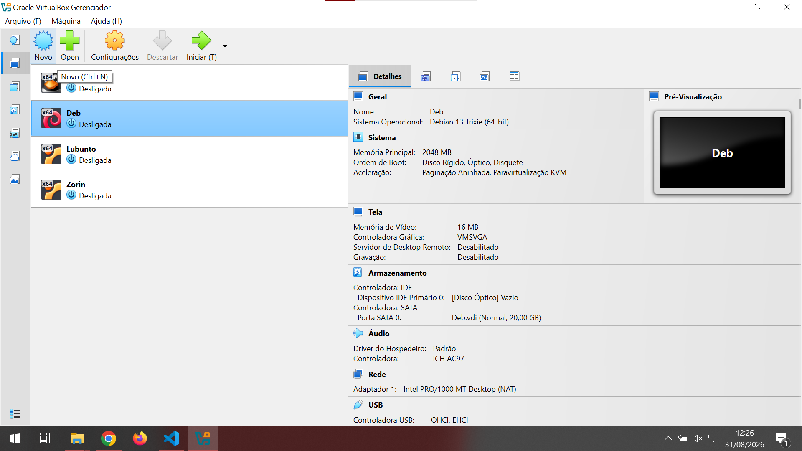

## 4. Nomeie a máquina virtual e selecione o arquivo .iso do seu sistema

Defina o nome da VM e, no campo **ISO Image**, selecione o arquivo de instalação do sistema.

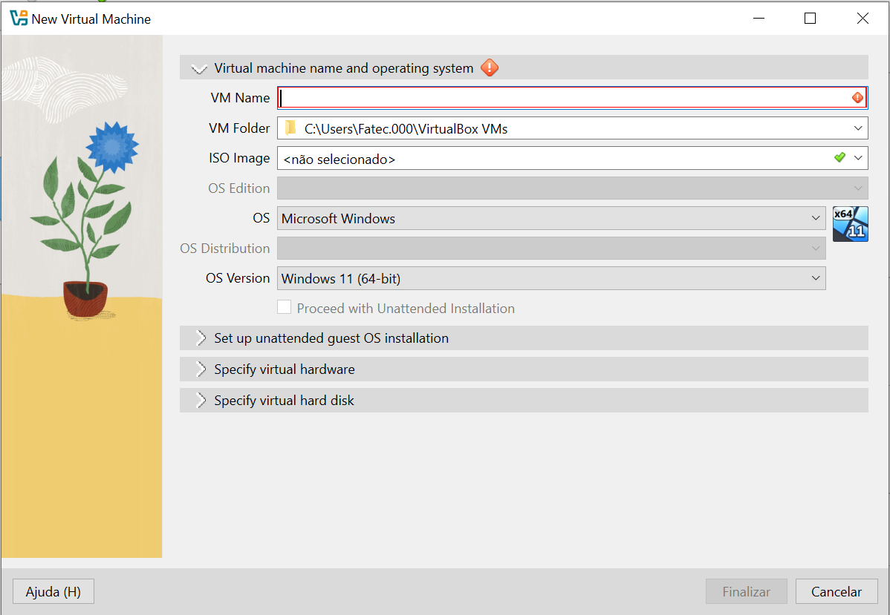

Ao abrir o menu suspenso, escolha a opção **Outro...** caso a ISO não esteja listada.

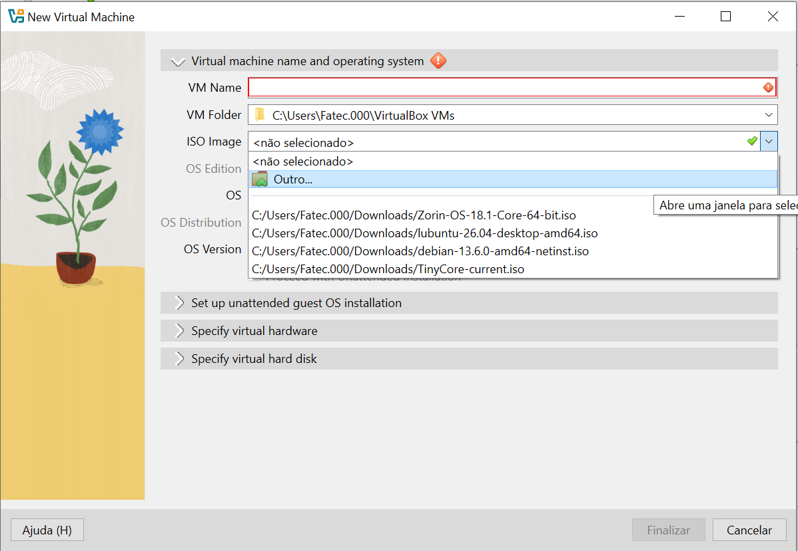

Localize o arquivo `.iso` no explorador de arquivos e clique em **Abrir**.

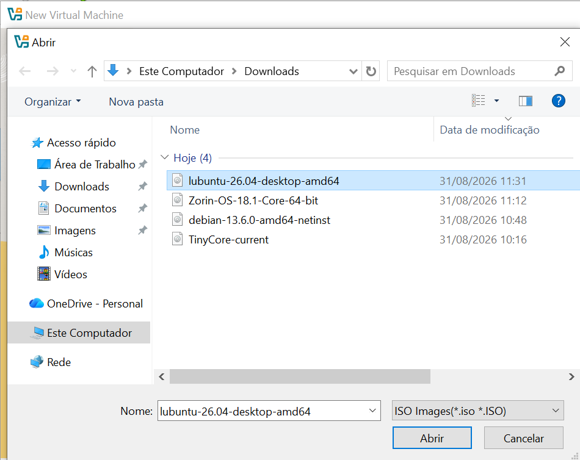

## 5. Uma aba com o nome que você deu irá aparecer na tela inicial do aplicativo

Após finalizar a criação, a máquina virtual aparecerá listada na tela principal do VirtualBox.

## 6. Selecione ela ou clique duas vezes

Selecione a máquina virtual criada e clique em **Iniciar** (ou dê duplo clique sobre ela).

## 7. Com o sistema virtualizado iniciado ele começará o processo de instalação

A VM inicializa a partir da ISO e exibe a tela de boot do sistema.

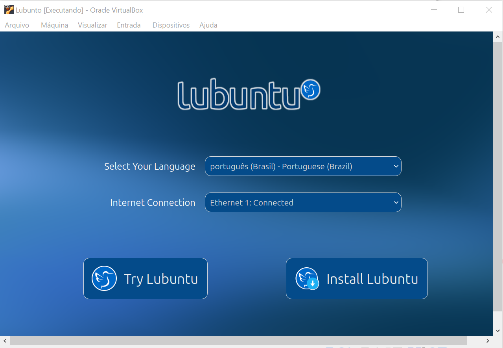

Ao optar por instalar, o instalador é aberto.

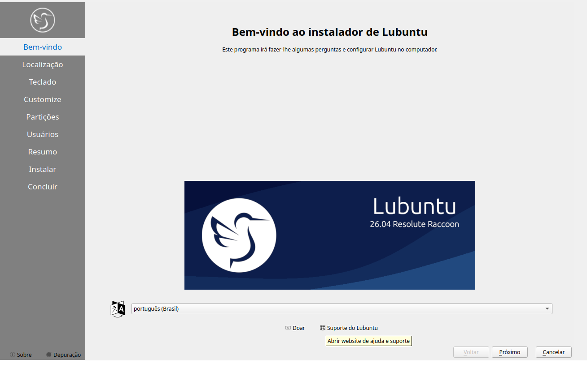

## 8. Realize as configurações iniciais

Configure localização, teclado, tipo de instalação, partições e usuário conforme as etapas do instalador.

**Localização:**

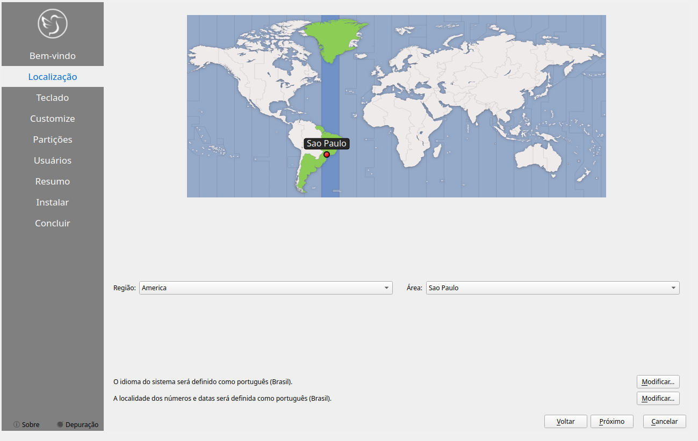

**Teclado:**

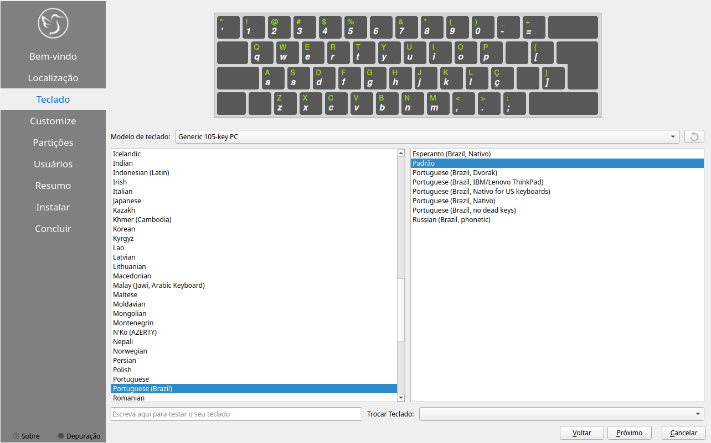

**Tipo de instalação (Customize):**

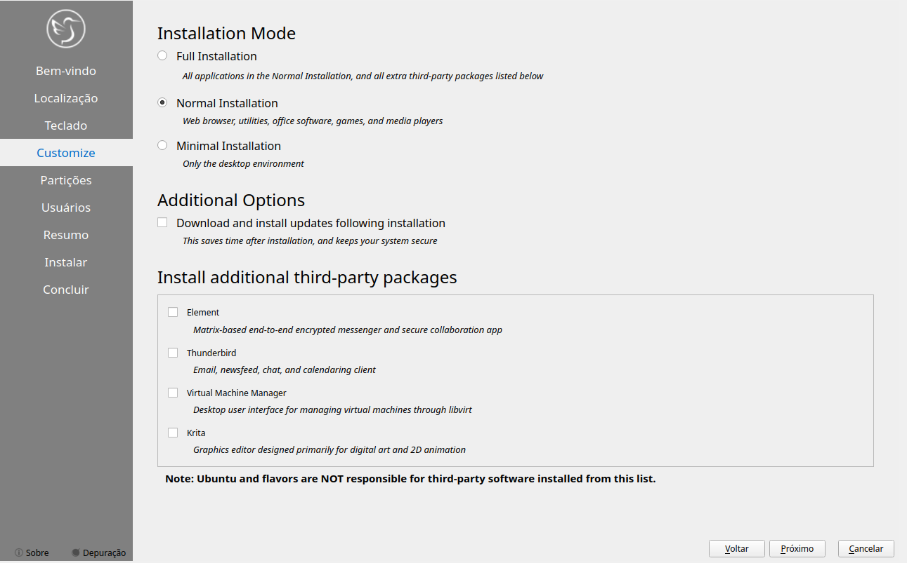

**Partições:**

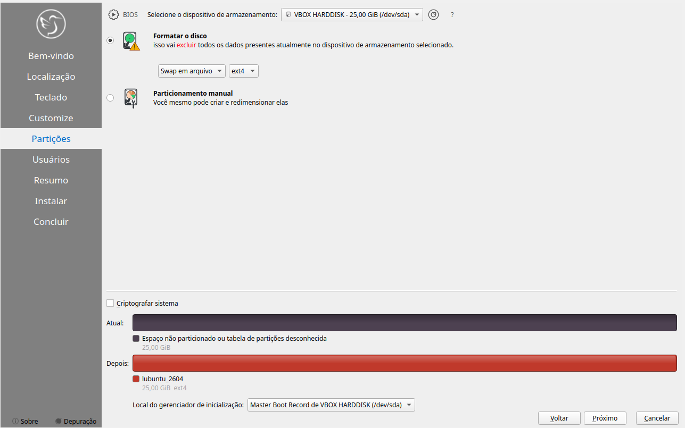

**Usuários:**

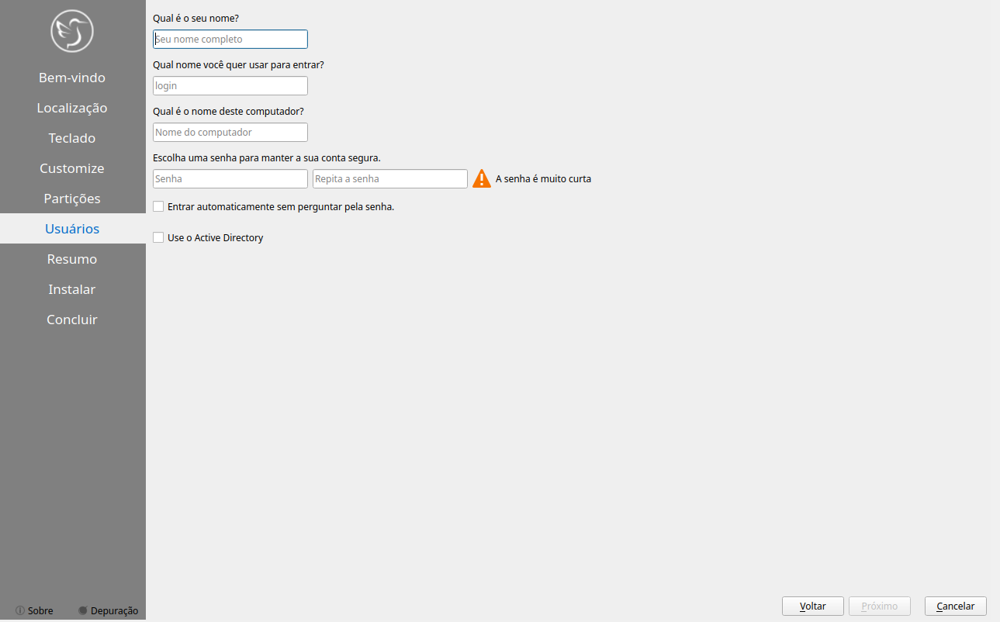

## 9. Inicie a instalação

Revise o resumo das configurações e confirme o início da instalação.

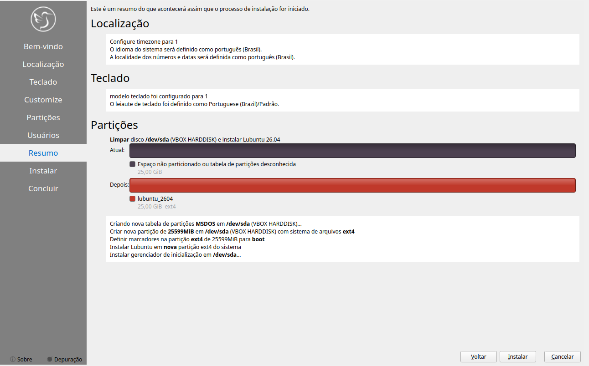

Confirme a alteração no disco para prosseguir.

Acompanhe o progresso da instalação.

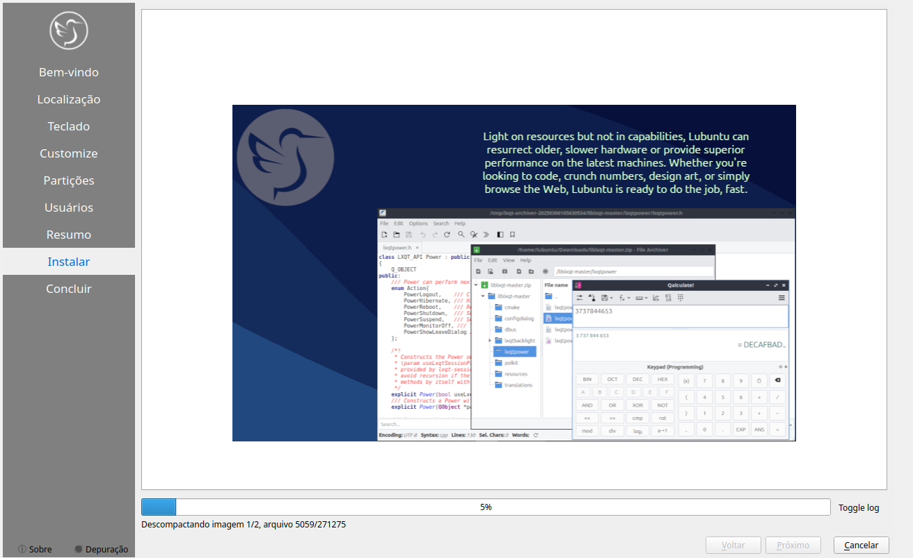

## 10. Após o fim, a máquina virtual irá reiniciar e iniciará o sistema escolhido

Ao concluir, a VM reinicia e carrega o sistema operacional já instalado, pronto para uso.

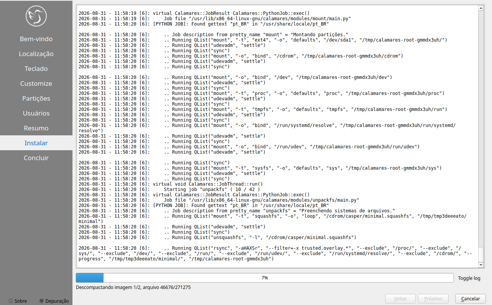
